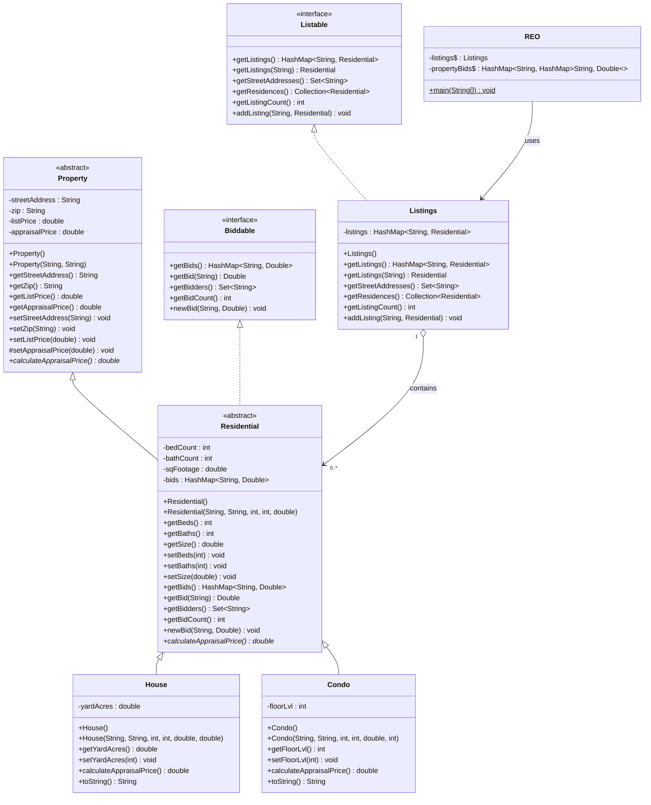

# Real Estate Management System
A Java-based real estate management system demonstrating OOP. Each week introduced new Java concepts such as abstract classes, interfaces, HashMap collections, and polymorphism—all integrated into a complete real estate office application that features property listings, automated appraisals, and competitive bidding functionality.

[](https://www.oracle.com/java/)
[](https://maven.apache.org/)
[](https://junit.org/junit5/)

## About

- **Course:** CS-115 Object-Oriented Programming (Java)
- **Institution:** Ensign College
- **Author:** Oliver Rivera
- **Semester:** Spring 2024

## Project Structure
```
real-estate-management-system/
├── src/
│   ├── main/
│   │   └── java/
│   │       └── RealEstate/
│   │           ├── Property.java        # Abstract base class for all properties
│   │           ├── Residential.java     # Abstract class extending Property, implements Biddable
│   │           ├── House.java           # Concrete class for single-family homes
│   │           ├── Condo.java           # Concrete class for condominiums
│   │           ├── Listable.java        # Interface for listing management operations
│   │           ├── Listings.java        # Implements Listable with HashMap storage
│   │           ├── Biddable.java        # Interface for bid management operations
│   │           └── REO.java             # Main application (menu system, user interface)
│   └── test/
│       └── java/
│           └── RealEstate/
│               ├── PropertyTest.java    # Unit tests for Property attributes
│               ├── ResidentialTest.java # Unit tests for Residential attributes
│               ├── HouseTest.java       # Unit tests for House-specific features
│               └── CondoTest.java       # Unit tests for Condo-specific features
├── .gitignore                       # Git ignore rules for Java/Maven projects
├── pom.xml                          # Maven project descriptor
└── README.md                        # Project documentation
```

---

## Set Up & Run

Clone the repository and navigate to the project directory:
```bash
git clone git@github.com:olael94/real-estate-management-system.git
cd real-estate-management-system
```

Ensure you have JDK 21+ installed:
```bash
java -version
```

Start the application by compiling and running the `REO` main class.:
```bash
# Compile
mvn clean compile

# Run
mvn exec:java
```

To run unit tests:
```bash
mvn test
```

---

## UML Class Diagram
The diagram shows the system's three-tier inheritance hierarchy: Property (base) → Residential (middle) → House/Condo (concrete). Two interfaces define contracts: Biddable for bid management and Listable for property collections. Residential implements Biddable to track bids, while Listings implements Listable to manage properties via HashMap. REO is the main application class that coordinates the system.


---
## Project Evolution

| Week | Feature | Key Concepts |
|------|---------|--------------|
| 4 | Class Hierarchy | Inheritance, constructors, getters/setters, three-tier hierarchy |
| 6 | Abstraction & Appraisals | Abstract classes, polymorphic methods, protected setters |
| 8 | Menu System | Scanner input, nested menus, switch statements, boolean flags |
| 10 | Listings Module | Interfaces, HashMap collections, Iterator, toString() formatting |
| 12 | Bidding System | Multiple interfaces, Random class, auto-population algorithms |

---

## Example Run
Below is a sample of a full program session, showing user interaction, property management, and bidding functionality.

### Main Menu

```java
-----------------------------------

             Main Menu                

-----------------------------------

1: Listings
2: Bids

What would you like to do? (1-2): 1
```

### Adding a House Listing

```java


-----------------------------------

            Listing Menu               

-----------------------------------


1: Add Listing
2: Show Listings
3: Auto Populate Listings (Dev tool)
ENTER: Exit back to the previous menu.

What would you like to do? (1-3): 1


-----------------------------------

          Add Listing Menu             

-----------------------------------


1: Add House
2: Add Condo
ENTER: Exit back to the previous menu.

What would you like to do? (1-2): 1
Please enter the street address for the residence: 1234 Maple St
Please enter the zip code for the residence: 84101
Please enter the number of bedrooms: 4
Please enter the number of bathrooms: 3
Please enter the square footage of the residence: 2500
Please enter the size of the yard in acres: 0.25

Appraisal Price for this property is: $501,500.00
Please enter the List Price for the property: $525000

You have created a new listing!


-------------------------------------------------------------------------------------------------------
Residence Type: House              Address: 1234 Maple St             Zip Code: 84101               
-------------------------------------------------------------------------------------------------------
Sq Footage: 2500
Bedrooms: 4
Bathrooms: 3
Yard Size (Acres): 0.25
----------------------------------------
Appraisal Price: $501,500.00
List Price: $525,000.00
----------------------------------------
```

**Appraisal Algorithm (House):**
- $97.00 per square foot
- Additional $10,000.00 for each bedroom
- Additional $12,000.00 for each bathroom
- Additional $460,000.00 per full acre yard

**Calculation:** (97 × 2500) + (10,000 × 4) + (12,000 × 3) + (460,000 × 0.25) = $501,500

---

### Adding a Condo Listing

```java
What would you like to do? (1-2): 2
Please enter the street address for the residence: 789 Downtown Ave
Please enter the zip code for the residence: 84102
Please enter the number of bedrooms: 2
Please enter the number of bathrooms: 2
Please enter the square footage of the residence: 1200
Please enter the floor level of the condo: 15

Appraisal Price for this property is: $157,600.00
Please enter the List Price for the property: $165000

You have created a new listing!


-------------------------------------------------------------------------------------------------------
Residence Type: Condo              Address: 789 Downtown Ave          Zip Code: 84102               
-------------------------------------------------------------------------------------------------------
Sq Footage: 1200
Bedrooms: 2
Bathrooms: 2
Floor: 15
----------------------------------------
Appraisal Price: $157,600.00
List Price: $165,000.00
----------------------------------------
```

**Appraisal Algorithm (Condo):**
- $88.00 per square foot
- Additional $8,000.00 for each bedroom
- Additional $10,000.00 for each bathroom
- Additional $5,000.00 per floor level

**Calculation:** (88 × 1200) + (8,000 × 2) + (10,000 × 2) + (5,000 × 15) = $157,600

---

### Show All Listings

```java


-----------------------------------

            Listing Menu               

-----------------------------------


1: Add Listing
2: Show Listings
3: Auto Populate Listings (Dev tool)
ENTER: Exit back to the previous menu.

What would you like to do? (1-3): 2


Current Listings for REO:


Listing No: 1

-------------------------------------------------------------------------------------------------------
Residence Type: House              Address: 1234 Maple St             Zip Code: 84101               
-------------------------------------------------------------------------------------------------------
Sq Footage: 2500
Bedrooms: 4
Bathrooms: 3
Yard Size (Acres): 0.25
----------------------------------------
Appraisal Price: $501,500.00
List Price: $525,000.00
----------------------------------------


Listing No: 2

-------------------------------------------------------------------------------------------------------
Residence Type: Condo              Address: 789 Downtown Ave          Zip Code: 84102               
-------------------------------------------------------------------------------------------------------
Sq Footage: 1200
Bedrooms: 2
Bathrooms: 2
Floor: 15
----------------------------------------
Appraisal Price: $157,600.00
List Price: $165,000.00
----------------------------------------
```

**Concepts:**
- Menu-driven architecture with nested submenus
- HashMap for efficient property storage and retrieval
- Iterator pattern for collection traversal
- Polymorphic toString() method calls
- String.format() for professional receipt-style output
- Currency formatting with %,.2f specifiers

### Auto-Populate Listings (Testing Tool)

```java
What would you like to do? (1-3): 3

8 residences have been added to the listings for testing purposes.
```

This developer tool creates 8 pre-configured properties (5 houses, 3 condos) for quick testing.

---

### Adding Bids to Properties

```java
-----------------------------------

             Main Menu                

-----------------------------------

1: Listings
2: Bids

What would you like to do? (1-2): 2


-----------------------------------

              Bids Menu                

-----------------------------------


1: Add New Bid
2: Show Existing Bids
3: Auto Populate Bids (Dev tool)
ENTER: Exit back to the previous menu.

What would you like to do? (1-3): 1

Current Listings for REO:

1: 1234 Maple St (0)
2: 789 Downtown Ave (0)
3: 34 Elm (0)
4: 42 Hitchhikers (0)
5: 4876 Industrial (0)
6: 2654 Oak (0)
7: 9875 Lexington (0)
8: 3782 Market (0)
9: 7608 Glenwood (0)
10: 1220 Apple (0)
ENTER: Exit back to the previous menu.

For which property would you like to add a bid?: 1

-------------------------------------------------------------------------------------------------------
Residence Type: House              Address: 1234 Maple St             Zip Code: 84101               
-------------------------------------------------------------------------------------------------------
Sq Footage: 2500
Bedrooms: 4
Bathrooms: 3
Yard Size (Acres): 0.25
----------------------------------------
Appraisal Price: $501,500.00
List Price: $525,000.00
----------------------------------------


Please enter the name of the bidder: John Smith
Please enter the new bid: $510000

New bid for property '1234 Maple St' added.
```

### Viewing Existing Bids

```java


-----------------------------------

              Bids Menu                

-----------------------------------


1: Add New Bid
2: Show Existing Bids
3: Auto Populate Bids (Dev tool)
ENTER: Exit back to the previous menu.

What would you like to do? (1-3): 2

Current Listings for REO:

1: 1234 Maple St (1)
2: 789 Downtown Ave (0)
3: 34 Elm (0)
4: 42 Hitchhikers (0)
5: 4876 Industrial (0)
6: 2654 Oak (0)
7: 9875 Lexington (0)
8: 3782 Market (0)
9: 7608 Glenwood (0)
10: 1220 Apple (0)
ENTER: Exit back to the previous menu.

For which property would you like to add a bid?: 1

-------------------------------------------------------------------------------------------------------
Residence Type: House              Address: 1234 Maple St             Zip Code: 84101               
-------------------------------------------------------------------------------------------------------
Sq Footage: 2500
Bedrooms: 4
Bathrooms: 3
Yard Size (Acres): 0.25
----------------------------------------
Appraisal Price: $501,500.00
List Price: $525,000.00
----------------------------------------


Current bids for this listing:
---------------------------------------
      Bidder              Bid
---------------------------------------
John Smith                $510000.00
```

### Auto-Populate Bids (Testing Tool)

```java
What would you like to do? (1-3): 3


2 new bids have been added to listing 1234 Maple St.

7 new bids have been added to listing 789 Downtown Ave.

5 new bids have been added to listing 34 Elm.

9 new bids have been added to listing 42 Hitchhikers.

3 new bids have been added to listing 4876 Industrial.

4 new bids have been added to listing 2654 Oak.

6 new bids have been added to listing 9875 Lexington.

8 new bids have been added to listing 3782 Market.

5 new bids have been added to listing 7608 Glenwood.

2 new bids have been added to listing 1220 Apple.
```

**Auto-Population Algorithm:**
- Random number of bids (2-10) per property
- Bid amounts: appraisalPrice ± 10% (random within range)
- Bidder names: 18 Star Trek character names (random selection)

**Concepts:**
- Random class for algorithmic generation
- Percentage-based calculations
- HashMap bidder storage (name → amount)
- Array-based name pool for random selection

---

## Key Features

### Polymorphic Appraisal System
Each property type implements its own `calculateAppraisalPrice()` algorithm:
- **House:** Square footage, bedrooms, bathrooms, yard acreage
- **Condo:** Square footage, bedrooms, bathrooms, floor level

### Bidding Management
- Track multiple bids per property using HashMap<String, Double>
- Display bid counts in property selection menus
- Update or add new bids with automatic HashMap management

### Professional Output Formatting
- Formatted property details with aligned columns
- Currency display with comma separators ($501,500.00)
- Table-style bid listings with headers

### Developer Tools
- Auto-populate 8 test properties with realistic data
- Auto-generate 2-10 random bids per property
- Quick testing without manual data entry

---

## Key Skills Demonstrated

- **Abstract classes & inheritance** for code reuse and extensibility
- **Multiple interface implementation** (Listable, Biddable)
- **HashMap collections** for efficient property and bid storage
- **Polymorphism** through abstract method implementation
- **Iterator pattern** for collection traversal
- **Random algorithms** for test data generation
- **Menu-driven console UI** with nested navigation
- **Input validation** and error handling
- **Unit testing** with JUnit framework
- **String formatting** for professional output

---

## Testing

The project includes comprehensive JUnit test coverage:

- **PropertyTest:** Tests for address, zip code, list price, and appraisal price
- **ResidentialTest:** Tests for bedroom, bathroom, and square footage attributes
- **HouseTest:** Tests for yard acreage and house-specific appraisal calculations
- **CondoTest:** Tests for floor level and condo-specific appraisal calculations

All tests verify both getter/setter functionality and the accuracy of appraisal algorithms.

---

## Contact

**Oliver Rivera**  
GitHub: [@olael94](https://github.com/olael94)

---

⭐ Star this repo if you find it helpful!
